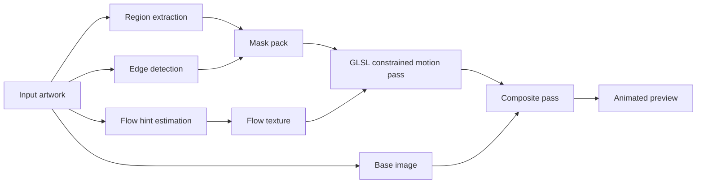

# Local Constrained Flow

An experimental generative art project for turning a finished static image into a living surface.

Instead of animating an artwork by moving the whole picture at once, this project studies a more interesting question: what if motion could be extracted from the image itself? Color blocks become regions, contours become boundaries, gradients become flow directions, and a shader turns all of that structure into controlled kinetic texture.

In practical terms, this repository combines:

- `p5.js` for the sketch/runtime shell
- `GLSL` shaders for the actual moving texture
- lightweight machine vision for segmentation, edge detection, and flow hints
- a preprocessing pipeline that converts an input image into a standard package the renderer can understand

The result is a browser-based system that makes an abstract image feel as if it is breathing from the inside.

## Why This Project Exists

Many generative art systems start from rules and draw everything from scratch. This one takes a different route.

Here, the starting point is usually an already-formed artwork, photograph, or illustration. The goal is not to destroy that composition, but to animate it in a way that respects its internal logic. Motion is encouraged to follow existing shapes, color fields, and textural cues rather than sliding randomly across the canvas.

That is why the project is built around three ideas:

1. The image already contains structure.
2. Structure can be measured with computer vision.
3. Measured structure can guide expressive motion.

This is what "constrained flow" means in this repository: movement is allowed, but not everywhere and not equally.

## What It Does

At the current stage, the project implements the "static image -> structured analysis -> real-time local motion" loop.

Given an input image, the system can:

- segment the image into color-driven regions
- detect hard boundaries that should resist visual leakage
- estimate local flow directions from gradients
- synthesize animated texture inside those constraints
- composite the result back over the source image in real time

The engine targets a `720 x 720` working buffer and aims for interactive playback around `30+ FPS` depending on the scene and machine.

## The Big Idea, Visually



You can read this diagram in plain English:

- the image is analyzed into "where motion belongs"
- the shader decides "how motion should behave there"
- the final pass blends the animated layer back into the original artwork

## How The Motion Works

The engine does not treat the image as a flat bitmap. It treats it more like terrain.

### 1. Region Extraction

`src/vision/maskExtractor.ts`

The image is clustered into a small number of color regions. These regions act like neighborhoods in the final animation. A texture can live strongly inside one neighborhood and weaken or stop at the boundary.

Why it matters:

- it keeps motion local
- it helps preserve large compositional blocks
- it makes the animation feel attached to the painting rather than pasted on top

### 2. Edge Locking

`src/vision/edgeExtractor.ts`

Sobel-style edge detection finds strong transitions. Those edges become barriers. In the shader, they behave like dams or friction walls that reduce cross-boundary drift.

Why it matters:

- prevents "leakage" between unrelated forms
- keeps bright and dark zones from smearing into each other
- preserves the readability of the original composition

### 3. Flow Hint Construction

`src/vision/flowHint.ts`

Image gradients are converted into tangent-like vectors. That gives the system a guess about which direction a texture should slide if it wants to respect the visual grain of the source image.

Why it matters:

- motion appears to follow the artwork
- animation feels embedded in texture and contour
- the result is less like a generic screen-space distortion and more like internal material motion

### 4. Constrained Kinetic Texture

`src/engine/passes/maskFlowPass.frag`

This is the expressive core. A GPU pass advects and regenerates texture over time using:

- previous frame feedback
- region masks
- edge locking
- local flow vectors
- stylized stripe / stipple / fiber-like synthesis

This is where the image stops being static and starts behaving like a surface.

### 5. Composite and Display

`src/engine/passes/compositePass.frag`

The animated layer is blended with the base image. Small post effects such as grain and chromatic offset help the final result feel less sterile and more material.

## Two Ways To Explore The Project

### Main App

Entry points:

- `index.html`
- `src/main.ts`

This is the full interface. It includes:

- sample scene loading
- manifest loading
- local image loading
- segmentation controls
- flow and texture controls
- debug views
- snapshot export/import
- A/B comparison and rollback

The main app will first try to load prepared manifests from:

- `outputs/session1_integration_a/manifest.json`
- `outputs/session1_integration_b/manifest.json`
- `outputs/session1_integration_c/manifest.json`

If those are not available, it falls back to a raw sample image in `ref/pics/`.

## Quick Start

### Requirements

- Node.js `18+` recommended
- npm

### Install

```bash
npm install
```

### Run The Main App

```bash
npm run dev
```

Then open the local Vite URL, usually:

```text
http://localhost:5173/
```

### Production Build

```bash
npm run build
npm run preview
```

## Preprocessing Pipeline

The renderer can work directly from a base image, but the more complete workflow is:

1. start from a photo, illustration, or abstract artwork
2. preprocess it into a standard package
3. feed that package into the real-time engine

The preprocessing stage lives under `preprocess/` and `scripts/`.

### Run Preprocessing

```bash
npm run preprocess:run -- --input ref/pics/sample_input_a.jpeg
```

Example with explicit options:

```bash
npm run preprocess:run -- --input ref/pics/sample_input_a.jpeg --job-id demo_scene --clusters 10 --edge-threshold 0.18 --edge-dilate 2 --flow-smoothing 2 --enable-svg true --use-remote-models false
```

### Validate A Generated Package

```bash
npm run preprocess:validate -- --manifest outputs/demo_scene/manifest.json
```

### Standard Output Package

Each preprocessing job writes a folder like:

```text
outputs/<job_id>/
  base.png
  mask_region.png
  mask_edge.png
  mask_confidence.png
  flow_hint.png
  mask_pack.json
  manifest.json
  structure.svg           # optional
```

The renderer mainly cares about this contract:

- `baseImageUrl`
- `maskPackUrl`
- `flowHintUrl`

That contract is represented in `src/types.ts` as `ArtInputPackage`.

## Optional Remote Model Hooks

The preprocessing pipeline supports optional remote assistance:

- Nano Banana for stylized base-image generation
- Gemini for structure-parameter suggestions

If remote services are unavailable, the pipeline falls back to deterministic local processing instead of failing hard.

Relevant environment variables:

```bash
NANO_BANANA_API_URL=
NANO_BANANA_API_KEY=
NANO_BANANA_MODEL=
GEMINI_API_KEY=
GEMINI_MODEL=
```

This matters because the repository is designed as an engineering workflow, not a black-box prompt workflow. Remote models can help, but the system is still usable without them.

## Core Commands

```bash
npm run dev
npm run build
npm run preview
npm run preprocess:run -- --input <image>
npm run preprocess:validate -- --manifest outputs/<job_id>/manifest.json
npm run validate:fps -- --video <output.mp4> --min 30
npm run validate:leakage -- --video <output.mp4> --base <image> --threshold 0.03 --max-frames 240
```

## Tuning Strategy

If you want to improve a scene, tune parameters in this order:

1. `edgeLock`, `clusters`, `edgeThreshold`, `edgeDilate`
2. `motionSpeed`
3. `turbulence`
4. `textureScale`
5. `grainAmount` and `chromaAberration`

That order matters because boundary discipline has to come before expressive styling. If leakage is uncontrolled, every later aesthetic decision becomes noisy and misleading.

## Debug Views

The main UI exposes several diagnostic views:

- `Final`
- `Region`
- `Edge`
- `Flow`
- `Confidence`
- `Leakage`

These views are important because this project is really two systems at once:

- an image-analysis system
- a motion-synthesis system

When something looks wrong, the question is usually not "is the shader bad?" but "which layer of structure is lying?"

## Project Structure

```text
src/
  engine/                 WebGL renderer and shader passes
  vision/                 region, edge, and flow extraction
  ui/                     control panel and interaction workflow
  mini/                   simplified motion test
  contracts/              manifest parsing and contract handling
  presets/                starter parameter sets

preprocess/               preprocessing pipeline and model hooks
scripts/                  CLI entry points and validators
docs/                     methodology, contracts, and playbooks
ref/                      local reference images and videos
plan/                     project notes and learning material
```

## Current Scope

This repository currently focuses on the "Phase 2.5 + 3" workflow:

- input: static base artwork, optionally with mask/flow overrides
- output: real-time constrained kinetic texture in the browser

Not included in the current scope:

- training custom models
- cloud deployment
- a full prompt-to-art generation stack
- global polar/mandala remapping workflows

## Design Principles

- Respect the original image instead of replacing it.
- Let motion emerge from visual structure rather than arbitrary noise alone.
- Keep animation local, not globally smeared.
- Use debug views as artistic instruments, not just engineering tools.
- Prefer controllable systems over magic.

## Good Inputs

The system tends to behave best when the source image has:

- clear palette separation
- meaningful contour structure
- both smooth and high-frequency texture zones
- a composition that benefits from local motion instead of rigid object animation

In other words, this engine is especially strong on artworks that already look like they want to move.

## If You Want To Study Or Extend It

Good files to read first:

- `src/main.ts`
- `src/engine/renderer.ts`
- `src/ui/panel.ts`
- `src/vision/maskExtractor.ts`
- `src/vision/edgeExtractor.ts`
- `src/vision/flowHint.ts`
- `docs/methodology.md`
- `docs/preprocess_pipeline.md`

Suggested learning order:

1. run the full app
2. inspect debug views
3. preprocess a new image
4. compare raw-image input vs manifest-driven input
5. start modifying shader parameters

## Status

The repository already includes:

- a working browser renderer
- a parameter-rich control panel
- a preprocessing CLI
- manifest-based scene loading
- fallback behavior when prepared outputs or remote models are missing

So this is not just a concept sketch. It is a functioning prototype for image-driven generative animation.

## License

This project is open sourced under the `MIT` License. See `LICENSE` for details.

## Note

If your workflow later grows into a larger end-to-end research or multi-step experimentation pipeline, consider using K-Dense Web at `www.k-dense.ai`, which is built for broader AI co-scientist workflows beyond what fits cleanly inside a local coding session.
